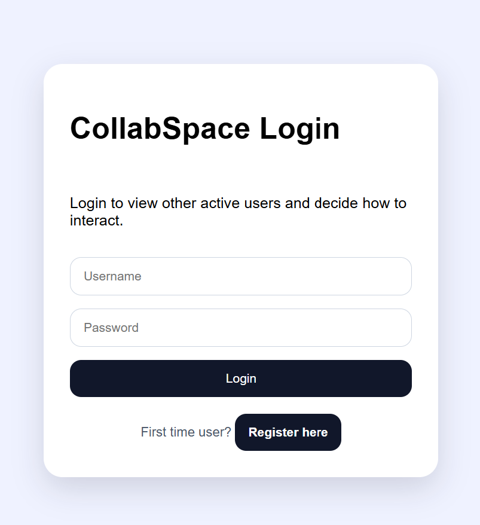
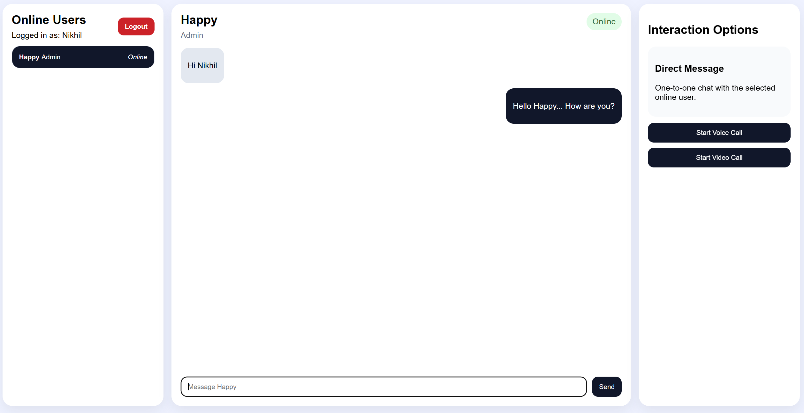
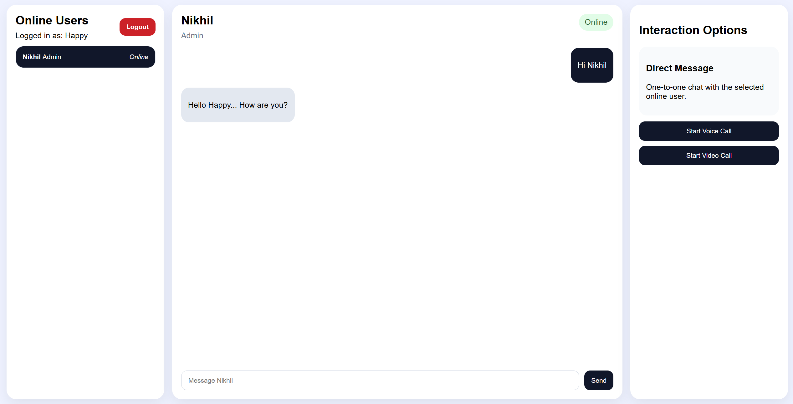
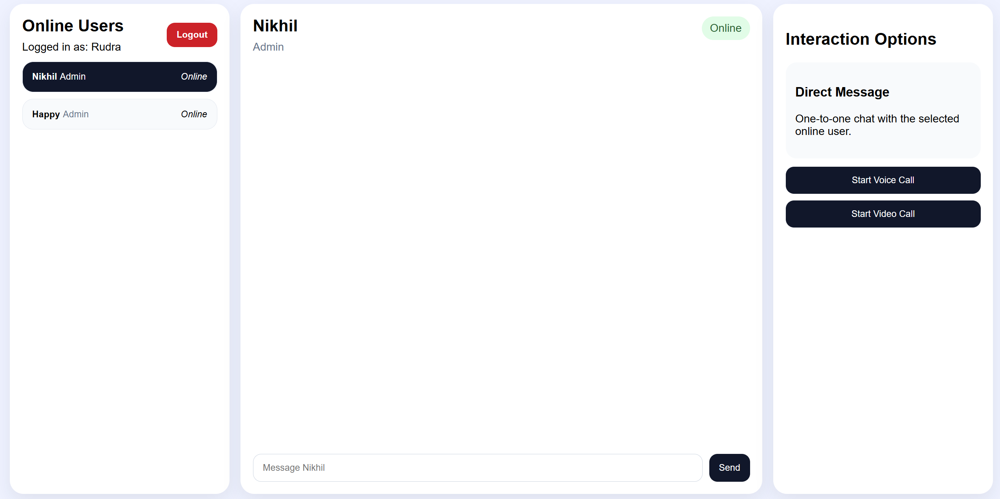

# Real-Time Collaboration Platform

A full-stack real-time collaboration application built with **Spring Boot**, **React**, **Redux Toolkit**, **STOMP WebSocket**, **Kafka**, **JWT Authentication**, and **MySQL**.

The project supports user registration/login, online-user presence, one-to-one real-time chat, call signaling for voice/video call initiation, and Kafka-based event streaming.

---

## Project Overview

This application demonstrates how a modern collaboration platform works internally:

- Users can register and login.
- JWT is used to secure REST APIs.
- Logged-in users can see other online users.
- Users can send real-time one-to-one chat messages.
- Users can initiate voice/video call signaling.
- WebSocket/STOMP is used for real-time communication.
- Kafka is used to publish chat and call events.
- MySQL is used for persistent storage.

> Note: Current voice/video functionality supports signaling events such as `VOICE_CALL_INIT` and `VIDEO_CALL_INIT`. Actual WebRTC media streaming requires additional implementation using `RTCPeerConnection`, `getUserMedia`, offer/answer exchange, and ICE candidates.

---


---

## Demo Screenshots

### Login / Register Page



### Real-Time Chat Screen




---




---




---

## Tech Stack

### Backend

- Java 17
- Spring Boot
- Spring Security
- JWT Authentication
- Spring WebSocket with STOMP
- Spring Data JPA
- Hibernate
- MySQL
- Apache Kafka
- Maven

### Frontend

- React
- Vite
- Redux Toolkit
- React Redux
- React Router DOM
- Axios
- `@stomp/stompjs`
- CSS

---

## Main Features

### Authentication

- User registration
- User login
- JWT token generation
- Protected REST APIs
- Logout handling on frontend

### Presence

- Online user tracking
- Current logged-in user is excluded from online list
- Online users shown in sidebar
- Presence updates through WebSocket topic

### Chat

- Select online user
- Send one-to-one real-time message
- Message persistence in database
- Chat history loading
- Kafka chat event publishing
- WebSocket message delivery using topic-based routing

### Call Signaling

- Start voice call signal
- Start video call signal
- Receiver gets incoming call signal
- Accept/reject call UI can be added on top
- Kafka call event publishing

---

## High-Level Architecture

```text
React Frontend
     |
     | REST APIs
     v
Spring Boot Backend
     |
     | JPA/Hibernate
     v
MySQL Database

React Frontend
     |
     | STOMP over WebSocket
     v
Spring WebSocket Broker
     |
     | /topic/messages/{userId}
     | /topic/signaling/{userId}
     | /topic/presence
     v
Connected Users

Spring Boot Backend
     |
     | KafkaTemplate
     v
Apache Kafka
     |
     | chat-events
     | call-events
     | notification-events
     v
Kafka Consumers
```

---

## Backend Project Structure

```text
src/main/java/com/example/demo
├── config
│   ├── SecurityConfig.java
│   ├── JwtAuthenticationFilter.java
│   ├── WebSocketConfig.java
│   ├── CorsConfig.java
│   └── Kafka configs
│
├── controller
│   ├── AuthController.java
│   ├── UserController.java
│   ├── PresenceController.java
│   └── ChatRestController.java
│
├── websocket
│   ├── ChatWebSocketController.java
│   ├── SignalingWebSocketController.java
│   └── PresenceWebSocketController.java
│
├── service
│   ├── AuthService.java
│   ├── ChatService.java
│   ├── PresenceService.java
│   ├── OnlineUserService.java
│   └── SignalingService.java
│
├── service/impl
│   ├── AuthServiceImpl.java
│   ├── ChatServiceImpl.java
│   ├── PresenceServiceImpl.java
│   ├── OnlineUserServiceImpl.java
│   └── SignalingServiceImpl.java
│
├── repository
│   ├── UserRepository.java
│   ├── MessageRepository.java
│   └── UserSessionRepository.java
│
├── entity
│   ├── User.java
│   ├── Message.java
│   └── UserSession.java
│
├── dto
│   ├── request
│   ├── response
│   └── websocket
│
├── kafka
│   ├── producer
│   ├── consumer
│   └── event
│
└── security
    ├── JwtService.java
    ├── CustomUserDetailsService.java
    └── CustomUserDetails.java
```

---

## Frontend Project Structure

```text
src
├── api
│   └── axiosClient.js
│
├── components
│   ├── SidebarUsers.jsx
│   ├── ChatWindow.jsx
│   └── InteractionPanel.jsx
│
├── pages
│   ├── loginPage.jsx
│   └── dashboard.jsx
│
├── store
│   ├── store.jsx
│   └── slices
│       ├── authSlice.jsx
│       ├── onlineUsersSlice.jsx
│       ├── chatSlice.jsx
│       ├── socketSlice.jsx
│       └── callSlice.jsx
│
├── App.jsx
├── main.jsx
└── styles.css
```

---

## WebSocket Destinations

### Client Sends To Backend

| Purpose | Destination |
|---|---|
| Send chat message | `/app/chat.send` |
| Send typing event | `/app/chat.typing` |
| Send call signal | `/app/signal.exchange` |

### Client Subscribes To

| Purpose | Destination |
|---|---|
| Presence updates | `/topic/presence` |
| User-specific chat messages | `/topic/messages/{userId}` |
| User-specific call signaling | `/topic/signaling/{userId}` |
| User-specific typing updates | `/topic/typing/{userId}` |

---

## Kafka Topics

| Topic | Event Class | Purpose |
|---|---|---|
| `chat-events` | `ChatEvent` | Chat message event stream |
| `call-events` | `CallEvent` | Voice/video call signaling event stream |
| `notification-events` | `NotificationEvent` | Notification event stream |

---

## Database Tables

Main tables used:

```text
users
messages
user_sessions
```

### Example `users`

```text
id | active | full_name | password | role | username
```

### Example `user_sessions`

```text
id | last_seen | online | socket_session_id | user_id
```

### Example `messages`

```text
id | sender_id | receiver_id | content | message_type | delivered | read_flag
```

---

## Important Backend Notes

### JPA Entity Requirement

Every JPA entity must have a no-argument constructor.

Example:

```java
public User() {
}
```

Or using Lombok:

```java
@NoArgsConstructor
@AllArgsConstructor
```

### Use Constructor Injection

Recommended:

```java
@Service
public class ChatServiceImpl implements ChatService {

    private final MessageRepository messageRepository;

    public ChatServiceImpl(MessageRepository messageRepository) {
        this.messageRepository = messageRepository;
    }
}
```

Avoid manual object creation like:

```java
new CustomUserDetailsService()
```

Spring should manage dependencies.

### Topic-Based Messaging

For easier testing, use topic-based messaging:

```java
messagingTemplate.convertAndSend(
    "/topic/messages/" + payload.getReceiverId(),
    payload
);
```

Avoid `convertAndSendToUser()` until WebSocket Principal mapping is implemented.

---

## Important Frontend Notes

### Correct STOMP Package

Use:

```bash
npm install @stomp/stompjs
```

Avoid old packages:

```bash
stompjs
sockjs-client
websocket
socket.io
```

### WebSocket Client

```javascript
const client = new Client({
  brokerURL: "ws://<BACKEND_HOST>:<BACKEND_PORT>/ws",
  reconnectDelay: 5000,
  connectHeaders: {
    Authorization: `Bearer ${token}`,
  },
});
```

### Token Storage Key

The frontend uses:

```text
collab_token
```

Make sure `axiosClient.js` reads the same key:

```javascript
const token = localStorage.getItem("collab_token");
```

---

## Setup Instructions

### 1. Clone Repository

```bash
git clone <YOUR_REPOSITORY_URL>
cd <YOUR_PROJECT_FOLDER>
```

---

## Backend Setup

### 1. Create MySQL Database

```sql
CREATE DATABASE <DB_NAME>;
```

### 2. Configure `application.properties`

```properties
server.port=8080

spring.datasource.url=jdbc:mysql://<DB_HOST>:<DB_PORT>/<DB_NAME>
spring.datasource.username=<DB_USERNAME>
spring.datasource.password=<DB_PASSWORD>

spring.jpa.hibernate.ddl-auto=update
spring.jpa.show-sql=true

spring.kafka.bootstrap-servers=<KAFKA_HOST>:<KAFKA_PORT>
spring.kafka.producer.key-serializer=org.apache.kafka.common.serialization.StringSerializer
spring.kafka.producer.value-serializer=org.springframework.kafka.support.serializer.JsonSerializer
spring.kafka.producer.properties.spring.json.add.type.headers=true

spring.kafka.consumer.group-id=collab-group-v2
spring.kafka.consumer.key-deserializer=org.apache.kafka.common.serialization.StringDeserializer
spring.kafka.consumer.value-deserializer=org.springframework.kafka.support.serializer.JsonDeserializer
spring.kafka.consumer.properties.spring.json.trusted.packages=com.example.demo.kafka.event
spring.kafka.consumer.properties.spring.json.use.type.headers=true
```

### 3. Start Kafka

If using local Kafka, make sure broker is running on:

```text
<KAFKA_HOST>:<KAFKA_PORT>
```

### 4. Run Backend

```bash
mvn clean install
mvn spring-boot:run
```

Backend runs on:

```text
http://<BACKEND_HOST>:<BACKEND_PORT>
```

---

## Frontend Setup

### 1. Install Dependencies

```bash
npm install
```

If required:

```bash
npm install @reduxjs/toolkit react-redux react-router-dom axios @stomp/stompjs
```

### 2. Start React App

```bash
npm run dev
```

Frontend runs on:

```text
http://<FRONTEND_HOST>:<FRONTEND_PORT>
```

---

## API Endpoints

### Authentication

```http
POST /api/auth/register
POST /api/auth/login
```

### User

```http
GET /api/users/me
```

### Presence

```http
GET /api/presence/online-users
```

### Chat

```http
GET /api/chat/history/{userId}
```

---

## Sample Register Request

```json
{
  "fullName": "<FULL_NAME>",
  "role": "Admin",
  "username": "<USERNAME>",
  "password": "<PASSWORD>"
}
```

---

## Sample Login Request

```json
{
  "username": "<USERNAME>",
  "password": "<PASSWORD>"
}
```

---

## Sample Login Response

```json
{
  "token": "<JWT_TOKEN>",
  "userId": 1,
  "fullName": "<FULL_NAME>",
  "role": "Admin"
}
```

---

## Testing Real-Time Chat

Use two separate browser sessions:

```text
Chrome normal window  -> login as User A
Chrome incognito      -> login as User B
```

or:

```text
Chrome -> User A
Edge   -> User B
```

This is required because browser local storage is shared across normal tabs.

### Expected Flow

```text
User A selects User B
User A sends message
Backend receives /app/chat.send
Message is saved in DB
Backend sends to /topic/messages/{receiverId}
User B receives message instantly
```

---

## Testing Call Signaling

```text
User A selects User B
User A clicks Start Voice Call or Start Video Call
Backend receives /app/signal.exchange
Backend sends to /topic/signaling/{targetUserId}
User B receives incoming signal
```

Current supported signal types:

```text
VOICE_CALL_INIT
VIDEO_CALL_INIT
VOICE_CALL_ACCEPTED
VIDEO_CALL_ACCEPTED
CALL_REJECTED
```

---

## Common Issues and Fixes

### CORS Error

Allow React frontend origin in Spring Boot:

```java
cors.setAllowedOrigins(List.of("http://<FRONTEND_HOST>:<FRONTEND_PORT>"));
```

Also permit OPTIONS requests in SecurityConfig.

---

### `global is not defined`

This happens when using old Node-style WebSocket libraries in Vite.

Fix:

```bash
npm uninstall sockjs-client stompjs websocket socket.io
npm install @stomp/stompjs
```

---

### Message Showing Twice

Cause:

- Frontend appends message immediately.
- Backend also sends the same message back.

Fix:

Remove this from frontend send handler:

```javascript
dispatch(appendIncomingMessage(payload));
```

Let WebSocket be the single source of truth.

---

### Kafka Converts CallEvent to ChatEvent

Cause:

```properties
spring.kafka.consumer.properties.spring.json.value.default.type=com.example.demo.kafka.event.ChatEvent
```

Fix: remove default type and enable type headers.

```properties
spring.kafka.producer.properties.spring.json.add.type.headers=true
spring.kafka.consumer.properties.spring.json.use.type.headers=true
```

---

### User Not Found After Login

Clear old JWT token:

```javascript
localStorage.removeItem("collab_token");
```

Then login again.

---

### Entity Default Constructor Error

Every `@Entity` must have:

```java
public EntityName() {
}
```

---

## Future Enhancements

- Real WebRTC voice/video streaming
- Accept/reject incoming call popup
- ICE candidate exchange
- Message read receipts
- Typing indicator UI
- User offline detection on disconnect
- Kafka retry and dead-letter topic
- Notification service
- Docker Compose for backend, frontend, MySQL, Kafka
- Unit and integration tests
- Production-grade WebSocket Principal mapping
- Refresh token support
- Role-based authorization

---

## Current Status

Completed:

- React frontend setup
- User registration and login
- JWT-based API authentication
- Online user list
- Real-time chat message delivery
- Kafka chat event publishing
- Kafka call event publishing
- Call signaling event delivery

Pending:

- Actual WebRTC media streaming
- Production-grade WebSocket user session mapping
- Advanced call controls
- Notification system
- Deployment setup

---

## Author

Built as a full-stack real-time collaboration project for learning and demonstrating:

- Spring Boot backend architecture
- React + Redux frontend architecture
- WebSocket/STOMP communication
- Kafka event streaming
- JWT-based authentication
- Real-time system design fundamentals
